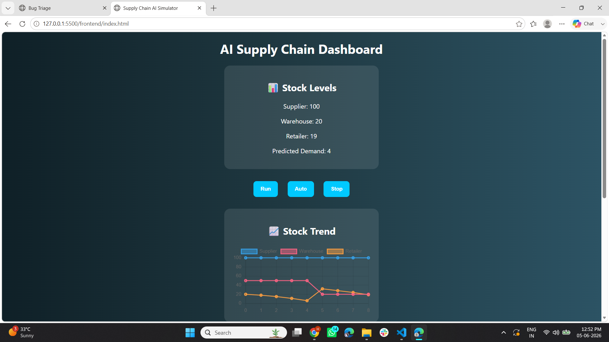
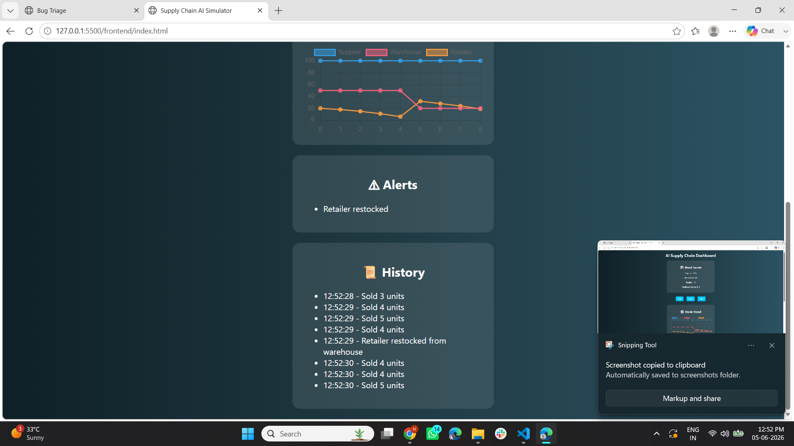

# 🔗 Supply Chain Management

A web-based supply chain management system to track, manage and optimize the flow of goods, data and resources from supplier to customer.

---

## 🚀 Features
- ✅ Inventory tracking and management
- ✅ Order processing and status updates
- ✅ Supplier and customer management
- ✅ Real-time data monitoring
- ✅ Simple and intuitive web interface

---

## 🛠️ Technologies Used
- Python
- Flask
- HTML5
- CSS3
- JavaScript

---

## ⚙️ How to Run

### Backend
1. Clone the repository
2. Install dependencies:
3. Run the app:
### Frontend
4. Go to the frontend folder
5. Open `index.html` with **Live Server** in VS Code

---

## 📸 Screenshots

---

## 📜 License
This project is licensed under the MIT License.
